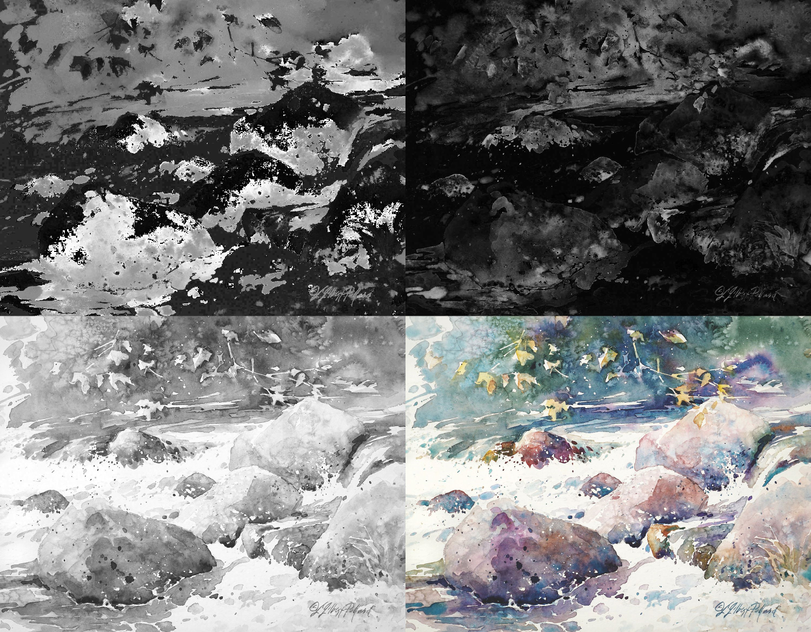

# HSV Map Generator


*Result of running `hsv_mapgen -d 2x2 -c hue:sat:val:orig -j 80`*

### About

This is a shader-based image processing utility that generates grayscale images ("maps")
representing a colored image's hue, saturation, and value. It can also do the same for an
image's red, green, and blue values. The program can either output a single-image collage of
the maps, or output them separately.

Minimum requirements: GPU that supports [OpenGL 3.3](https://www.khronos.org/opengl/wiki/History_of_OpenGL#OpenGL_3.3_.282010.29)

### Installation

This project can be downloaded as an executable binary from [here](https://mangosaver.com),
or built from source via CMake.

#### CMake build instructions
1. Install CMake 3.20 or later
2. Navigate to the project's source directory
3. Run `cmake .` to configure the project
4. Run `cmake --build .` to build

If you run into build issues, delete CMakeCache.txt and try again.

### Usage & Examples

An image filename can be provided with `-i`, or a text file with a list of image filenames can be
provided with `-I`. By default, the program will create separate hue, saturation, and value maps of
the given image. The output will be a PNG.

To get a full list of options, run with the -h or --help flag:

```shell
hsv_mapgen --help
```

Example 1: create a 3x1 grid of an image's hue, saturation, and value called "my_grid.png"

```shell
hsv_mapgen -i my_input.png -d 3x1 -c hue:sat:val -o my_grid
```

Example 2: generate a grayscale maps of an image's hue, value, red, and blue

```shell
hsv_mapgen -i my_input.png -c hue:val:red:blue
```

The flags can be provided in any order. By default, it will output a PNG for each HSV component.

| Flags | Description |
| ----- | ----------- |
| `-h, --help` | Print the usage guide |
| `-i <file>` | (single file) Specify the input file |
| `-I <file>` | (batch processing) Specify a text file to read. The file must contain a list of image filenames, with one on each line |
|`-o` | (single file) Specify the output filename. It is not necessary to provide an extension |
| `-d, --dimensions <dims>` | Creates a single-image collage with the specified dimensions (width by height). Must be two numbers separated by an 'x', i.e. 1x3, 2x2, etc.|
| `-j, --jpeg [quality]` | Outputs a jpeg of specified quality (1-100). Default: 100 |

### Supported Image Types

[stb](https://github.com/nothings/stb) is used for image reading. It supports the following types:

- JPEG
- PNG
- TGA
- PSD
- GIF
- HDR
- PIC
- BMP

### Attribution

Example watercolor image (painting by Julie Gilbert Pollard): https://www.juliegilbertpollard.com/